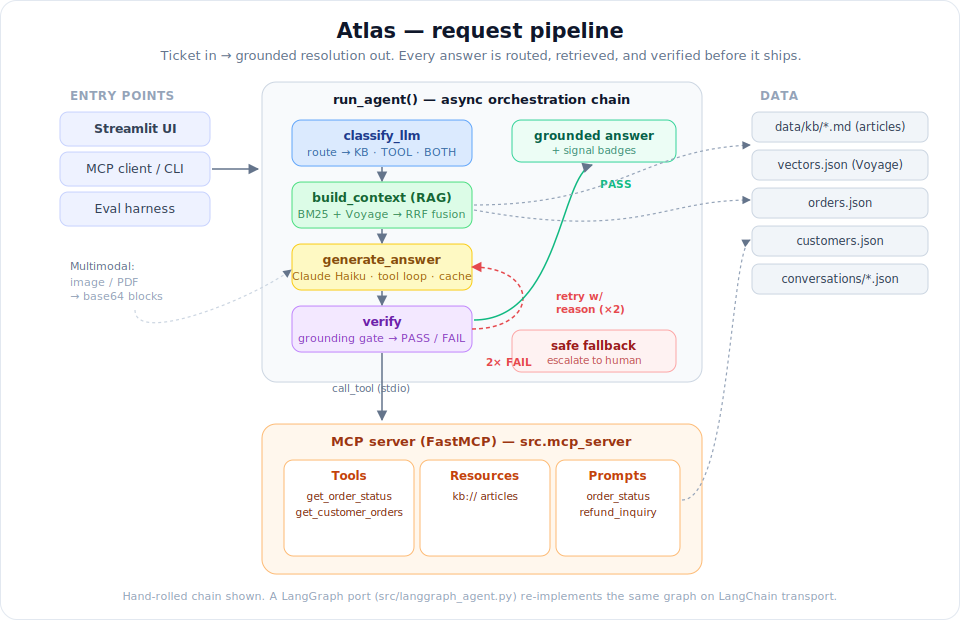

# Atlas — Northwind Support Agent

A customer-support agent for a fictional D2C coffee-gear brand ("Northwind"). Atlas
resolves tickets end to end: it answers from a knowledge base, calls real tools
(order lookup, account history), reads uploaded screenshots and receipts, and
**verifies every answer against its sources before replying** — falling back to a
human escalation when it can't ground the response.

Built on the raw Anthropic SDK plus a **Model Context Protocol (MCP)** server, with a
hand-rolled orchestration chain and a parallel [LangGraph](src/langgraph_agent.py) port
of the same graph.

<p align="center">
  
</p>

---

## What it does

- **Routing** — an LLM classifier tags each ticket `KB`, `TOOL`, or `BOTH`, so
  documentation lookup and live tool calls fire only when needed.
- **Hybrid RAG** — BM25 lexical search + Voyage AI semantic embeddings, combined with
  Reciprocal Rank Fusion over a Markdown knowledge base.
- **Tool use over MCP** — order and account tools run in an MCP server (`FastMCP`); the
  agent is the MCP client and calls them over stdio.
- **Grounding verification** — a verifier node judges each answer against the retrieved
  context and tool results. On failure it retries with the reason injected (max 2), then
  returns a safe human-escalation fallback rather than guessing.
- **Multimodal intake** — customers can attach a screenshot (PNG/JPG) or a receipt (PDF);
  files are turned into base64 content blocks.
- **Prompt caching** — the stable system prompt is cached (ephemeral) ahead of the
  variable context, cutting cost on repeat turns.
- **Persistence** — conversations are stored as JSON and survive restarts.
- **Evals** — a small harness with code-based and model-based grading gates every change.

## Interfaces

| Entry point | Command | Purpose |
|---|---|---|
| **Streamlit UI** | `streamlit run src/ui.py` | Chat demo with file upload and live signal badges |
| **CLI** | `python -m src.main` | One-shot agent run over an MCP session |
| **Evals** | `python -m src.evals` | Run the graded test suite |

The Streamlit UI surfaces the agent's internal decisions per response as badges —
**route** (KB/TOOL/BOTH), **verify** (pass/fail + attempt count), **cache** (tokens
written/read), and which **tools** fired — so the reasoning is visible, not buried in
stdout.

---

## Quickstart

Requires Python 3.12+. Run everything **from the repo root** (data paths and the MCP
server launch are relative).

```bash
# 1. install
python -m venv venv && source venv/bin/activate
pip install -r requirements.txt

# 2. configure keys (create .env in the repo root)
cat > .env <<'EOF'
ANTHROPIC_API_KEY=sk-ant-...
VOYAGE_API_KEY=pa-...
EOF

# 3. run the demo UI
streamlit run src/ui.py
```

Then try, in the UI:

- `how long do refunds take?` — KB route, grounded from the docs
- `what's the status of order NW-10001?` — TOOL route, live order lookup
- attach `data/uploads/AMD-image.jpeg` and ask what's in it — multimodal path
- `do refunds take 47 business days and require a blood sample?` — verify fails → escalation fallback

---

## How it works

`run_agent()` in [src/agent.py](src/agent.py) is the orchestration chain:

```
classify_llm  →  build_context (RAG)  →  generate_answer (tool loop)  →  verify
                                                    ▲                        │
                                                    └──── retry w/ reason ◀──┘  (×2)
                                                                             │
                                                              PASS → answer  │  2×FAIL → escalate
```

- **classify_llm** returns the route; retrieval is skipped for pure `TOOL` tickets.
- **build_context** ([src/search.py](src/search.py)) fuses BM25
  ([src/retrieval.py](src/retrieval.py)) and semantic hits
  ([src/embeddings.py](src/embeddings.py)) via RRF.
- **generate_answer** runs the Claude tool loop; tool calls are dispatched to the MCP
  server ([src/mcp_server.py](src/mcp_server.py)) over stdio.
- **verify** is a grounding gate — it compares the answer to the actual context and tool
  outputs and returns PASS or FAIL-with-reason.

The MCP server exposes all three MCP primitives: **tools** (`get_order_status`,
`get_customer_orders`), **resources** (`kb://` knowledge-base articles), and **prompts**
(templated support inquiries).

## Project structure

```
src/
  agent.py            orchestration chain (classify → retrieve → generate → verify)
  ui.py               Streamlit demo UI (chat, uploads, signal badges)
  retrieval.py        BM25 lexical search + KB chunking
  embeddings.py       Voyage AI semantic embeddings (cached to data/vectors.json)
  search.py           multi-index RRF fusion
  tools.py            order / account tool functions + schemas
  mcp_server.py       FastMCP server: tools, resources, prompts
  mcp_client.py       MCP client demo (lists tools/resources/prompts)
  multimodal.py       image / PDF → base64 content blocks
  conversations.py    JSON conversation persistence
  verify / retry      grounding gate + fallback (in agent.py)
  evals.py            graded eval harness (code + model grading)
  langgraph_agent.py  parallel LangGraph port of the same chain
data/
  kb/*.md             knowledge-base articles
  orders.json         50 synthetic orders
  customers.json      synthetic customers
  vectors.json        cached embeddings
  conversations/      saved chats
assets/
  atlas_pipeline.svg       request pipeline (above)
  atlas_architectures.svg  chain vs. workflow vs. agent comparison
```

## Tech stack

Anthropic Claude (Haiku) · Model Context Protocol / FastMCP · Voyage AI embeddings ·
`rank-bm25` · NumPy · Streamlit · LangGraph (parallel port).

---

## About this project

Atlas is a portfolio capstone for building agentic systems on the Claude API. It's
deliberately built on the **raw SDK** — hand-rolled routing, tool loop, RAG fusion, and
grounding checks — rather than leaning on a framework, so each layer is explicit and
inspectable. The [LangGraph port](src/langgraph_agent.py) re-implements the identical
graph on LangChain transport as a side-by-side comparison of framework vs. hand-rolled.
See [PROJECT.md](PROJECT.md) for the full scope and [PROGRESS.md](PROGRESS.md) for build
history.
